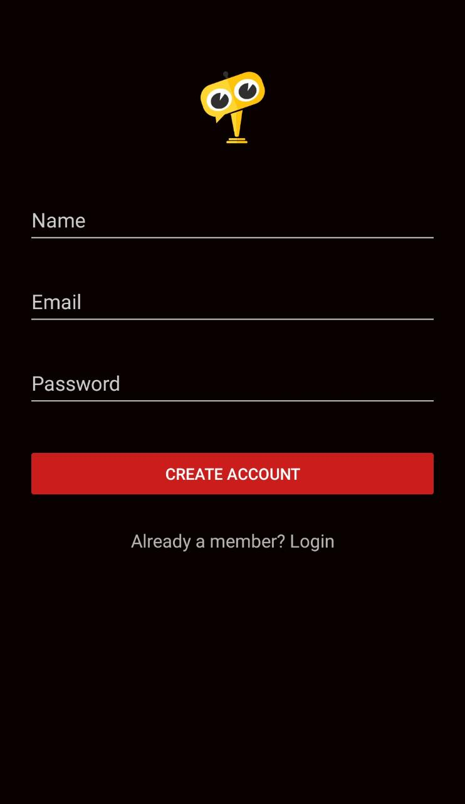
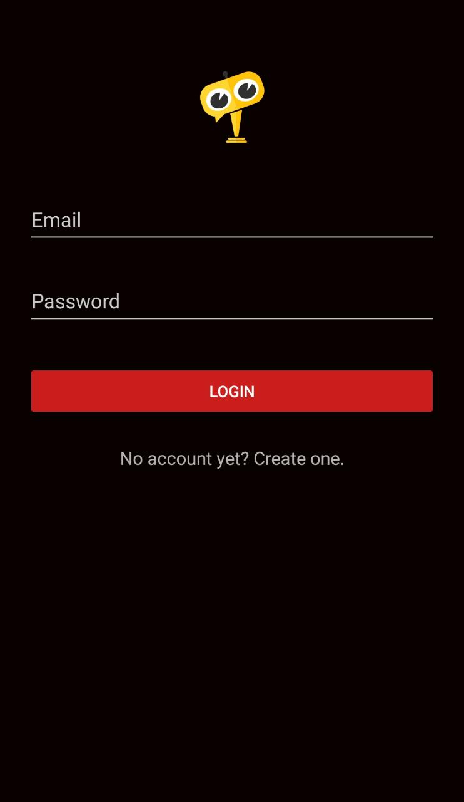
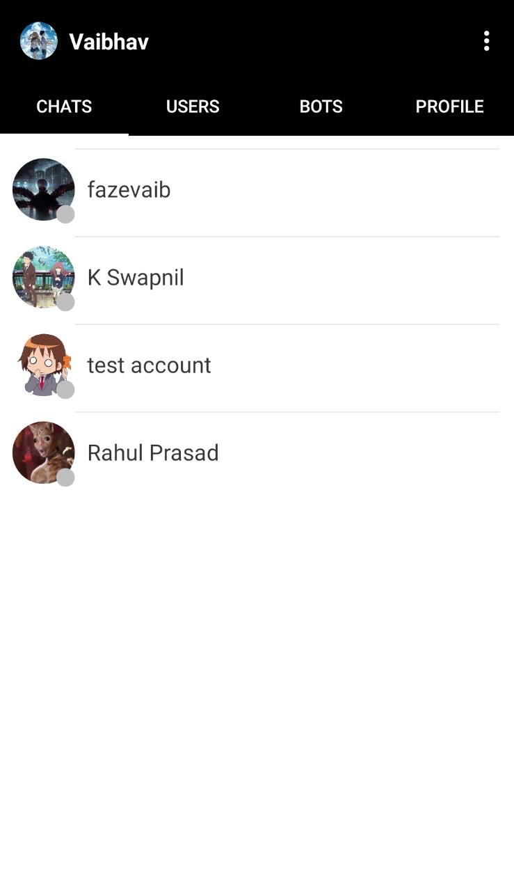
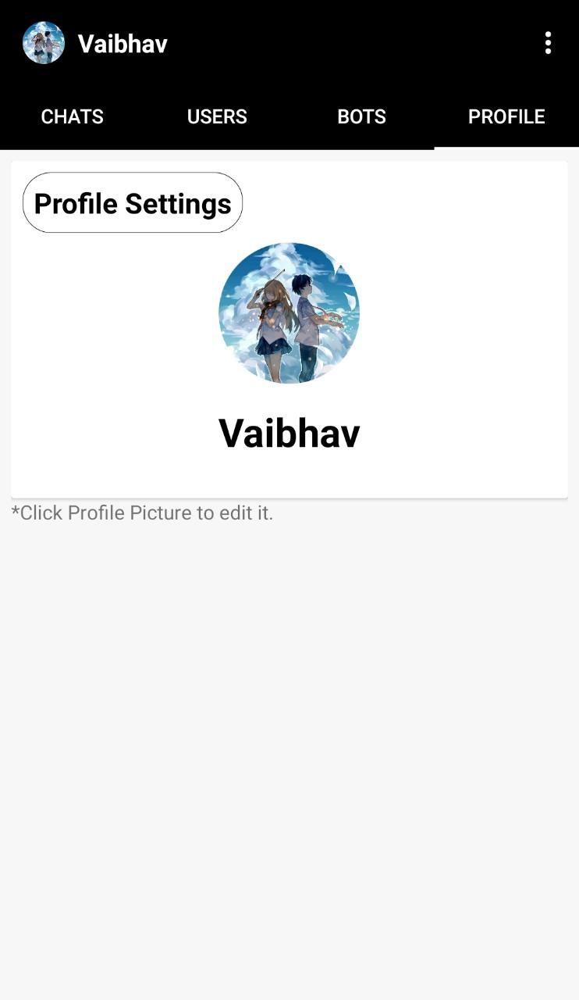
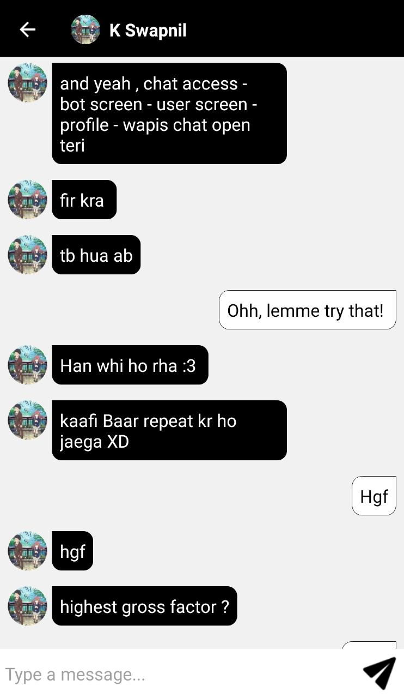

# RelaxBot

A android application that allows you chat with your friends as well as with custom trained bots

## Functionalities

- Create personal account
- Chat with the friends
- Shows if user is online or offline
- Change profile data like name and Display picture
- Talk with bots that are custom trained

## Register & Login Screen

 

## Home Screen

## Profile Page

## Chat Screen

## Work under Progress

- Connecting the custom chatbots to work on mobile without APIs
